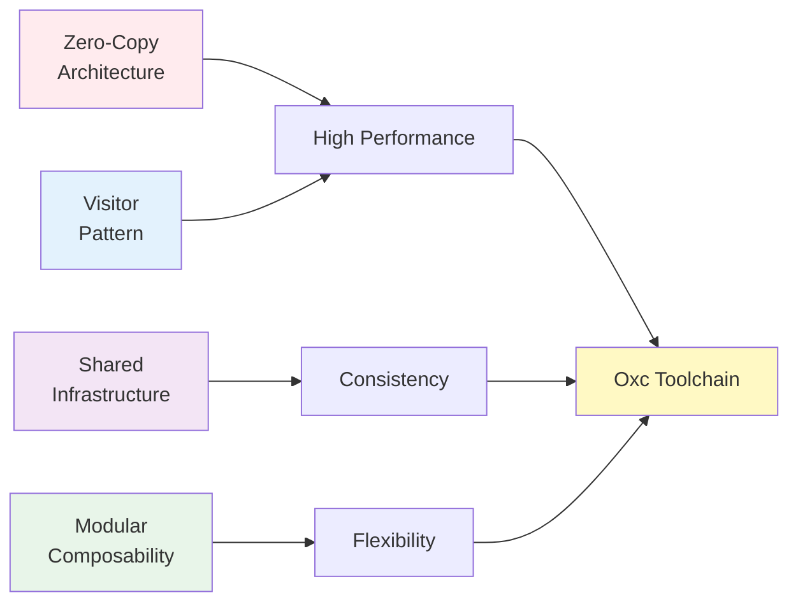
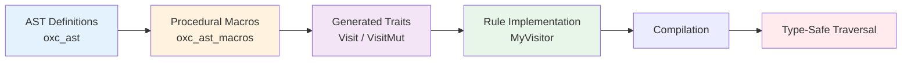
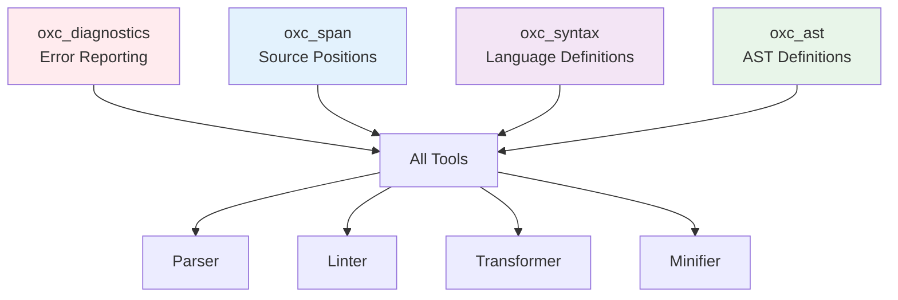
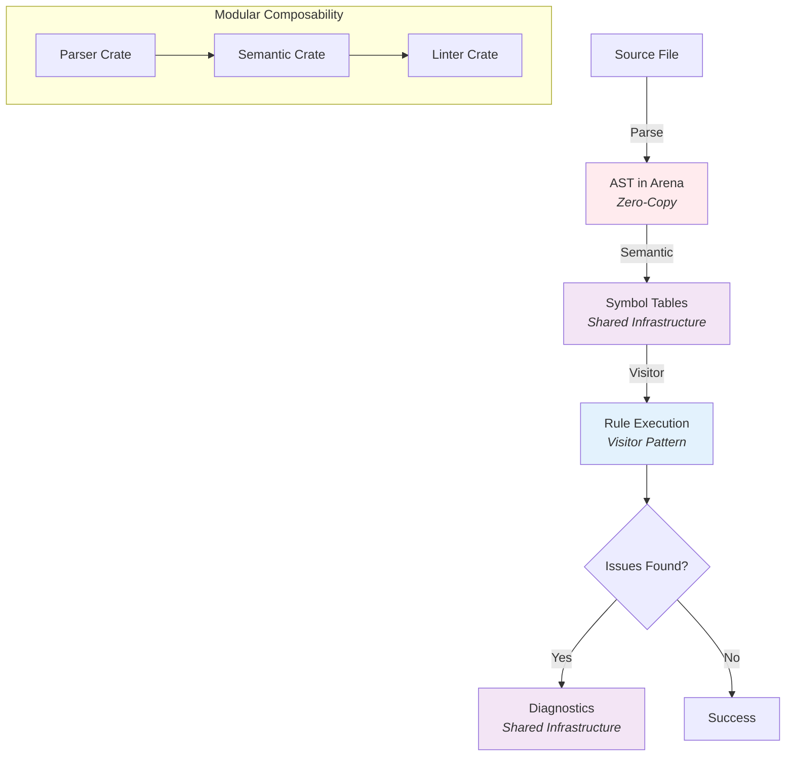

Oxc's architecture is built on four fundamental principles that work together to deliver exceptional performance while maintaining correctness and developer experience.

## The Four Pillars



## 1. Zero-Copy Architecture

<Info>
The zero-copy principle is the most critical aspect of Oxc's performance. By minimizing data copying and allocation overhead, Oxc achieves performance that is often 10-100x faster than comparable tools.
</Info>

### Arena-Based Allocation

At the heart of Oxc's zero-copy architecture is the **arena allocator** (`oxc_allocator`). All AST nodes for a compilation unit are allocated in a single memory arena.

#### How It Works

```rust
// Example: Creating AST nodes with arena allocation
use oxc_allocator::Allocator;
use oxc_parser::Parser;

let allocator = Allocator::default();
let source_text = "const x = 1;";
let parser_return = Parser::new(&allocator, source_text, source_type).parse();

// All AST nodes are in the arena - no individual allocations
// No reference counting overhead
// When allocator is dropped, all memory is freed at once
```

#### Benefits

<CardGroup cols={2}>
  <Card title="No Reference Counting" icon="gauge-high">
    Eliminates `Rc`/`Arc` overhead and atomic operations from hot paths
  </Card>
  <Card title="Cache Locality" icon="memory">
    Contiguous allocation improves CPU cache utilization
  </Card>
  <Card title="Fast Deallocation" icon="trash">
    Entire arena dropped at once - no individual node deallocation
  </Card>
  <Card title="Structural Sharing" icon="share-nodes">
    Enables efficient sharing of AST subtrees
  </Card>
</CardGroup>

### String Optimization

**Short strings** are inlined using [`CompactString`](https://crates.io/crates/compact_str):
- Strings ≤ 24 bytes on 64-bit systems are stored inline
- No heap allocation for small strings
- Transparent upgrade to heap allocation when needed

**Long strings** are allocated in the arena:
- Single allocation per string
- No copying during AST operations
- Lifetime tied to arena

### Lifetime Management

```rust
// All AST nodes have lifetime 'a tied to the allocator
struct Program<'a> {
    body: Vec<'a, Statement<'a>>,
    // ... other fields
}

// Ensures AST cannot outlive the allocator
// Compiler enforces memory safety at compile time
```

<Note>
While this requires explicit lifetime annotations, it provides compile-time guarantees of memory safety without runtime overhead.
</Note>

### Borrowed References in Hot Paths

Visitors operate on borrowed references (`&Node<'a>` or `&mut Node<'a>`), never owned values:
- No allocation during traversal
- No cloning of nodes
- Zero-copy reads and modifications

### Performance Impact

**Measured improvements** from arena allocation:
- **10-50% faster** parsing compared to `Rc`/`Arc`-based approaches
- **Predictable memory usage** - single large allocation vs many small ones
- **Faster garbage collection** - single `drop` instead of thousands

<Warning>
The arena allocator trades flexibility for performance. AST nodes cannot be easily moved between arenas or outlive their allocator.
</Warning>

## 2. Visitor Pattern

Oxc uses the **visitor pattern** for AST traversal, implemented through automatically generated traits via procedural macros.

### Generated Visitor Traits

Oxc provides two visitor traits:
- **`Visit`** - Immutable traversal (read-only analysis)
- **`VisitMut`** - Mutable traversal (AST transformation)

These traits are **automatically generated** from AST definitions using procedural macros (`oxc_ast_macros`).

### How It Works

```rust
use oxc_ast_visit::Visit;

// Implement only the methods you need
struct MyVisitor;

impl<'a> Visit<'a> for MyVisitor {
    fn visit_identifier_reference(&mut self, ident: &IdentifierReference<'a>) {
        // Custom logic for identifier references
        println!("Found identifier: {}", ident.name);
    }
    
    fn visit_function_declaration(&mut self, func: &Function<'a>) {
        // Custom logic for functions
        println!("Found function: {:?}", func.id);
        
        // Continue traversal
        walk_function(self, func);
    }
}
```

### Visitor Generation Process



### Benefits

<CardGroup cols={2}>
  <Card title="Type Safety" icon="shield-check">
    Compiler enforces correct usage - impossible to miss fields or use wrong types
  </Card>
  <Card title="Zero Boilerplate" icon="code">
    Only implement methods for nodes you care about
  </Card>
  <Card title="Efficient Dispatch" icon="gauge-high">
    Static dispatch - no virtual function overhead
  </Card>
  <Card title="Consistent Traversal" icon="sitemap">
    All tools traverse AST in same order
  </Card>
</CardGroup>

### Traversal Order

<Info>
Visitors traverse AST fields in the same order they are defined in the AST types, which follows the "Evaluation order" from the ECMAScript specification.
</Info>

Example for `VariableDeclaration`:
1. Visit `kind` (const/let/var)
2. Visit `declarations` (array of declarators)
3. For each declarator: pattern → initializer

This ensures consistent behavior across all tools and matches developer expectations.

### Alternative: Traverse

For more complex transformations, use **`oxc_traverse`**:
- Provides `Traverse` trait with enter/exit hooks
- Access to traversal context
- Ability to insert/remove nodes during traversal
- Scope-aware transformations

```rust
use oxc_traverse::Traverse;

impl<'a> Traverse<'a> for MyTransform {
    fn enter_expression(&mut self, expr: &mut Expression<'a>, ctx: &mut TraverseCtx<'a>) {
        // Transform on entry
    }
    
    fn exit_expression(&mut self, expr: &mut Expression<'a>, ctx: &mut TraverseCtx<'a>) {
        // Transform after children processed
    }
}
```

### Visitor Use Cases

| Tool | Visitor Type | Purpose |
|------|-------------|----------|
| **Linter** | `Visit` | Read-only analysis to detect issues |
| **Semantic** | `Visit` | Build symbol tables and scopes |
| **Transformer** | `Traverse` | Modify AST with scope awareness |
| **Minifier** | `Traverse` | Optimize and transform code |
| **Codegen** | Manual | Generate code (no visitor needed) |

## 3. Shared Infrastructure

Common functionality is shared across all components to ensure consistency and avoid duplication.

### Shared Foundation Crates



### oxc_diagnostics: Unified Error Reporting

**Purpose**: Consistent error messages across all tools

**Features**:
- Source code snippets with highlighting
- Multiple output formats (human-readable, JSON)
- Severity levels (error, warning, info)
- Related information and suggestions
- LSP-compatible diagnostics

**Example Output**:
```
  × Unexpected token
   ╭─[test.js:1:10]
 1 │ const x = ;
   ·          ─
   ╰────
  help: Expected an expression
```

### oxc_span: Unified Position Tracking

**Purpose**: Consistent source position representation

**Key Decisions**:
- Uses `u32` instead of `usize` for memory efficiency
- Byte-based offsets (not character-based)
- Supports UTF-8 correctly

**Structure**:
```rust
struct Span {
    start: u32,  // Byte offset from start of file
    end: u32,    // Byte offset from start of file
}
```

**Benefits**:
- Compact representation (8 bytes on 64-bit systems)
- Fast comparison and operations
- Consistent across all components
- Enables efficient source map generation

### oxc_syntax: Language Definitions

**Purpose**: Shared syntax knowledge

**Contents**:
- Token definitions
- Keyword mappings
- Operator precedence
- Node, reference, scope, and symbol flags
- Language feature flags

**Why Shared?**
- Ensures parser and semantic analyzer agree on syntax
- Single source of truth for language features
- Easier to add new language features

### Benefits of Sharing

<CardGroup cols={2}>
  <Card title="Consistency" icon="equals">
    All tools report errors in the same format and use the same definitions
  </Card>
  <Card title="Maintainability" icon="wrench">
    Changes to shared infrastructure benefit all tools
  </Card>
  <Card title="Smaller Binary" icon="compress">
    Code sharing reduces final binary size
  </Card>
  <Card title="Correctness" icon="check">
    Single source of truth reduces bugs from inconsistencies
  </Card>
</CardGroup>

## 4. Modular Composability

<Info>
Oxc is not a monolithic tool - it's a collection of independent, reusable components that can be composed in different ways.
</Info>

### Independent Crates

Each major component is published as an independent crate:

```toml
# Use just the parser
[dependencies]
oxc_parser = "0.x"
oxc_allocator = "0.x"
oxc_ast = "0.x"

# Or use the full toolchain
[dependencies]
oxc = { version = "0.x", features = ["full"] }
```

### Composition Patterns

#### Pattern 1: Parse Only

```rust
use oxc_allocator::Allocator;
use oxc_parser::Parser;

let allocator = Allocator::default();
let result = Parser::new(&allocator, source_text, source_type).parse();
let program = result.program;
// Use AST for analysis
```

#### Pattern 2: Parse + Semantic

```rust
use oxc_semantic::SemanticBuilder;

let parser_return = Parser::new(&allocator, source_text, source_type).parse();
let semantic = SemanticBuilder::new()
    .with_cfg(true)
    .build(&parser_return.program)
    .semantic;
// Access symbol tables and scopes
```

#### Pattern 3: Full Pipeline

```rust
use oxc_transformer::Transformer;
use oxc_codegen::Codegen;

// Parse
let parser_return = Parser::new(&allocator, source_text, source_type).parse();

// Semantic analysis
let semantic = SemanticBuilder::new().build(&parser_return.program).semantic;

// Transform
let mut program = parser_return.program;
let transform_result = Transformer::new(&allocator, transform_options)
    .build_with_scoping(semantic.scoping, &mut program);

// Generate code
let result = Codegen::new().build(&program);
let output_code = result.code;
```

### Use Cases

<Tabs>
  <Tab title="AST Analysis">
    **Need**: Just parse and analyze AST
    
    **Components**: `oxc_parser` + `oxc_allocator` + `oxc_ast`
    
    **Example**: ESLint plugin that analyzes code structure
  </Tab>
  
  <Tab title="Type Checking">
    **Need**: Parse, analyze, and check types
    
    **Components**: Parser + Semantic + custom type checker
    
    **Example**: Custom TypeScript type checker
  </Tab>
  
  <Tab title="Build Tool">
    **Need**: Parse, transform, and generate code
    
    **Components**: Full pipeline with transformer
    
    **Example**: Vite plugin, bundler
  </Tab>
  
  <Tab title="Documentation">
    **Need**: Parse and extract documentation
    
    **Components**: Parser + Semantic (with JSDoc feature)
    
    **Example**: API documentation generator
  </Tab>
</Tabs>

### Cargo Features

Components expose **cargo features** for fine-grained control:

```toml
[dependencies]
oxc_semantic = { version = "0.x", features = ["cfg", "jsdoc"] }
oxc_ast = { version = "0.x", features = ["serialize"] }
```

Common features:
- `serialize` - Enable ESTree JSON serialization
- `cfg` - Include control flow graph
- `jsdoc` - Parse JSDoc comments
- `linter` - Enable linter-specific optimizations

### Benefits

<CardGroup cols={2}>
  <Card title="Pay for What You Use" icon="wallet">
    Only include components you need - smaller binaries
  </Card>
  <Card title="Flexibility" icon="puzzle-piece">
    Compose tools in novel ways for custom use cases
  </Card>
  <Card title="Independent Evolution" icon="code-branch">
    Components can evolve independently with semantic versioning
  </Card>
  <Card title="Easy Integration" icon="plug">
    Drop individual components into existing projects
  </Card>
</CardGroup>

## Principles in Action: Linter Example

Let's see how all four principles work together in the linter:



**Step by Step**:

1. **Zero-Copy**: Parse file into arena-allocated AST
2. **Shared Infrastructure**: Use `oxc_span` for positions, `oxc_diagnostics` for errors
3. **Modular**: Parser and semantic analyzer are independent crates
4. **Visitor**: Each lint rule implements visitor pattern
5. **Zero-Copy**: Rules operate on borrowed AST references
6. **Shared Infrastructure**: All rules produce consistent diagnostics

## Design Trade-offs

<Warning>
These principles involve trade-offs. Oxc optimizes for performance and correctness at the cost of some development complexity.
</Warning>

### Arena Allocation

| Benefit | Trade-off |
|---------|----------|
| 10-50% faster performance | Requires lifetime annotations |
| Simpler memory management | Less flexible memory patterns |
| Better cache locality | Cannot easily share nodes between arenas |

### Visitor Pattern with Macros

| Benefit | Trade-off |
|---------|----------|
| Type-safe traversal | Longer compile times (proc macros) |
| Zero boilerplate | Learning curve for contributors |
| Compile-time guarantees | More complex error messages |

### Shared Infrastructure

| Benefit | Trade-off |
|---------|----------|
| Consistency across tools | Changes affect all components |
| Reduced duplication | More careful API design required |
| Smaller binaries | Tighter coupling between crates |

### Modular Composability

| Benefit | Trade-off |
|---------|----------|
| Flexible composition | More crates to manage |
| Smaller dependencies | Version compatibility complexity |
| Independent evolution | Need to maintain stable APIs |

## Related Reading

<CardGroup cols={2}>
  <Card title="Architecture Overview" icon="sitemap" href="/architecture/overview">
    Comprehensive overview of Oxc's architecture and components
  </Card>
  <Card title="Performance" icon="gauge-high" href="/architecture/performance">
    Deep dive into performance implementation and benchmarks
  </Card>
</CardGroup>
