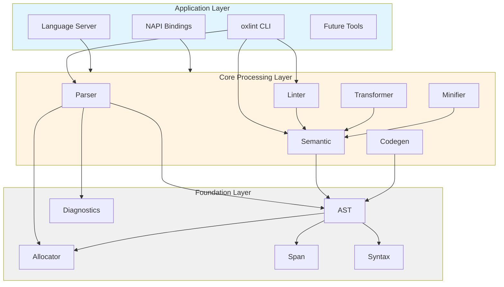
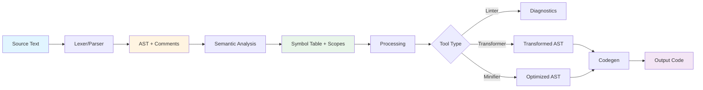
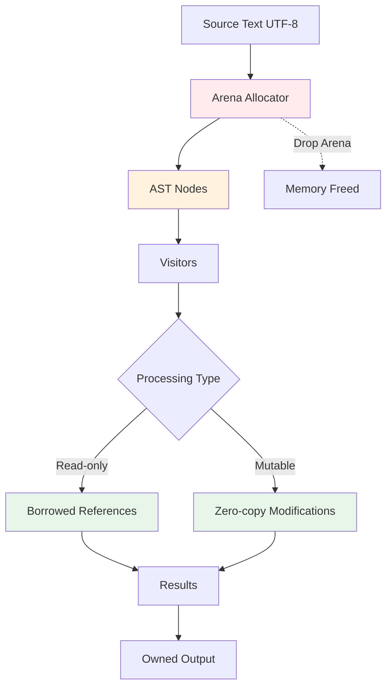

Oxc (The Oxidation Compiler) is a collection of high-performance JavaScript and TypeScript tools written in Rust. The system is designed as a modular, composable set of compiler components that can be used independently or together to build complete toolchains.

## Core Mission

<CardGroup cols={2}>
  <Card title="Performance" icon="gauge-high">
    Deliver 10-100x faster performance than existing JavaScript tools through rigorous performance engineering
  </Card>
  <Card title="Correctness" icon="check-circle">
    Maintain 100% compatibility with JavaScript/TypeScript standards through comprehensive testing
  </Card>
  <Card title="Modularity" icon="puzzle-piece">
    Enable users to compose tools according to their specific needs with independent, reusable components
  </Card>
  <Card title="Developer Experience" icon="code">
    Provide excellent error messages, clear APIs, and comprehensive tooling integration
  </Card>
</CardGroup>

## System Architecture

Oxc follows a layered architecture with three distinct tiers:

## Foundation Layer

The foundation layer provides the essential building blocks used by all other components.

### oxc_allocator

**Purpose**: Arena-based memory allocator for zero-copy operations

<Info>
The allocator is the most critical component for Oxc's performance. All AST nodes are allocated in a single arena, eliminating reference counting overhead and enabling zero-copy operations.
</Info>

**Key Features**:
- Single allocation arena for entire compilation unit
- Eliminates need for `Rc`/`Arc` in hot paths
- Enables structural sharing of AST nodes
- Predictable memory layout for better cache locality

**Implementation Details**:
- Built on top of `bumpalo` with custom optimizations
- Provides arena-allocated versions of `Box`, `Vec`, `String`, `HashMap`, `HashSet`
- Uses lifetime management tied to the arena
- No garbage collection - manual memory management for predictable performance

**Location**: `crates/oxc_allocator/src/lib.rs:1`

### oxc_span

**Purpose**: Source position tracking and text manipulation

**Key Features**:
- Byte-based indexing (u32) for UTF-8 correctness
- Efficient span operations for source maps
- Integration with diagnostic reporting

<Warning>
Because `Span` uses `u32` instead of `usize`, Oxc can only parse files up to 4 GiB in size. This shouldn't be a limitation in almost all cases.
</Warning>

**Location**: `crates/oxc_span/src/`

### oxc_syntax

**Purpose**: JavaScript/TypeScript language definitions

**Key Features**:
- Token definitions and keyword mappings
- Language feature flags (ES2024+, TypeScript)
- Shared syntax validation logic
- Node, reference, scope, and symbol flag definitions

**Location**: `crates/oxc_syntax/src/`

### oxc_diagnostics

**Purpose**: Error reporting and diagnostic infrastructure

**Key Features**:
- Rich error messages with source context
- Multiple output formats (JSON, pretty-printed)
- Integration with Language Server Protocol
- Span-based error locations

**Location**: `crates/oxc_diagnostics/src/`

### oxc_ast

**Purpose**: Abstract Syntax Tree definitions and utilities

**Key Features**:
- Complete JavaScript/TypeScript AST coverage
- Generated visitor traits for type safety
- Serialization support for caching (ESTree compatible)
- Arena-allocated node structures

**Location**: `crates/oxc_ast/src/lib.rs:1`

#### AST Design Philosophy

<Note>
Oxc's AST differs significantly from the [estree](https://github.com/estree/estree) specification by removing ambiguous nodes and introducing distinct types for better type safety.
</Note>

Instead of using a generic estree `Identifier`, Oxc provides specific types:

- **`BindingIdentifier`** - for variable declarations and bindings
- **`IdentifierReference`** - for variable references  
- **`IdentifierName`** - for property names and labels

This distinction aligns more closely with the ECMAScript specification and greatly enhances the development experience.

**Field Order**: AST types follow "Evaluation order" defined by the ECMAScript specification. Oxc's visitors (`Visit`, `VisitMut`, `Traverse`) visit AST node fields in the same order as defined in the types.

## Core Processing Layer

The core layer implements the primary compiler operations.

### oxc_parser

**Purpose**: JavaScript/TypeScript parsing

**Key Features**:
- Hand-written recursive descent parser
- Full ES2024+ and TypeScript support
- JSX and TSX support
- Stage 3 Decorators support
- Preservation of comments and trivia

**Implementation Strategy**:
- Lexer and parser are tightly integrated
- Minimal API: allocator + source text + source type → AST
- Delegates scope binding and symbol resolution to semantic analyzer
- Uses `u32` offsets instead of `usize` for memory efficiency

**Location**: `crates/oxc_parser/src/lib.rs:1`

### oxc_semantic

**Purpose**: Semantic analysis and symbol resolution

**Key Features**:
- Scope chain construction
- Symbol table generation  
- Reference tracking
- Dead code detection
- Optional Control Flow Graph (CFG) generation

**What It Provides**:
- `AstNodes` - Parent-pointing tree structure
- `Scoping` - Scope tree and symbol tables
- `ClassTable` - Class hierarchy information
- JSDoc parsing (when enabled)

**Location**: `crates/oxc_semantic/src/lib.rs:1`

### oxc_linter

**Purpose**: ESLint-compatible linting engine

**Key Features**:
- 200+ built-in rules
- Plugin architecture for custom rules
- Automatic fixing for many rules
- Configuration compatibility with ESLint
- Multi-threaded file processing

**Implementation Details**:
- Rules implemented using visitor pattern
- Each rule visits specific AST node types
- Rules are organized by category (correctness, style, suspicious, etc.)
- Generated enum for efficient rule dispatch

**Location**: `crates/oxc_linter/src/lib.rs:1`

### oxc_transformer

**Purpose**: Code transformation and transpilation

**Key Features**:
- TypeScript to JavaScript transformation
- Modern JavaScript feature transpilation (ES2015-ES2026)
- React JSX transformation
- Babel plugin compatibility layer
- Configurable target environments

**Transform Pipeline**:
1. TypeScript stripping
2. Modern JavaScript feature transforms
3. JSX transformation
4. Helper injection

**Location**: `crates/oxc_transformer/src/lib.rs:1`

### oxc_minifier

**Purpose**: Code size optimization

**Key Features**:
- Dead code elimination
- Constant folding and propagation
- Identifier mangling integration
- Statement and expression optimization
- Peephole optimizations

**Location**: `crates/oxc_minifier/src/`

### oxc_codegen

**Purpose**: AST to source code generation

**Key Features**:
- Configurable output formatting
- Source map generation
- Comment preservation options
- Minified and pretty-printed output modes

**Location**: `crates/oxc_codegen/src/`

## Application Layer

The application layer provides end-user tools built on top of the core components.

### oxlint

**Command-line linter application**

**Features**:
- File discovery and parallel processing
- Configuration file support (`.oxlintrc.json`, ESLint compatible)
- Multiple output formats
- Integration with CI/CD systems
- Extremely fast: lints 4800+ files in ~0.7 seconds

**Location**: `apps/oxlint/`

### Language Server

**LSP implementation for editor integration**

**Features**:
- Real-time diagnostics
- Go-to-definition and find references
- Symbol search and completion
- Hover information

**Location**: `crates/oxc_language_server/`

### NAPI Bindings

**Node.js integration layer**

**Packages**:
- `oxc-parser` - Parser bindings
- `oxc-transform` - Transformer bindings
- `oxc-minify` - Minifier bindings
- `oxc-resolver` - Module resolver

**Features**:
- Async processing support
- Zero-copy buffer operations where possible
- TypeScript type definitions

**Location**: `napi/`

## Data Flow

### Compilation Pipeline

### Memory Management Flow

**Key Points**:
1. All AST nodes are allocated in the arena
2. Visitors operate on borrowed references
3. No reference counting in hot paths
4. Arena is dropped all at once when processing completes
5. Strings are inlined using `CompactString` when short

## Crate Organization

Oxc consists of **31 crates** organized by functionality:

**Foundation** (5 crates):
- `oxc_allocator`, `oxc_span`, `oxc_syntax`, `oxc_diagnostics`, `oxc_ast`

**Core Processing** (6 crates):
- `oxc_parser`, `oxc_semantic`, `oxc_linter`, `oxc_transformer`, `oxc_minifier`, `oxc_codegen`

**Supporting** (remaining crates):
- AST utilities: `oxc_ast_macros`, `oxc_ast_visit`, `oxc_traverse`
- Analysis: `oxc_cfg` (control flow), `oxc_ecmascript`
- Specialized: `oxc_mangler`, `oxc_formatter`, `oxc_isolated_declarations`
- Utilities: `oxc_data_structures`, `oxc_regular_expression`, etc.

## Design Decisions

### Arena Allocator vs Rc/Arc

**Decision**: Use custom arena allocator instead of reference counting

**Rationale**:
- Eliminates reference counting overhead (atomic operations)
- Enables zero-copy string operations
- Simplifies memory management
- Improves cache locality through contiguous allocation

**Trade-offs**:
- ✅ 10-50% performance improvement
- ✅ Simplified ownership model
- ✅ Faster allocation and deallocation
- ❌ Requires lifetime management
- ❌ Less flexible memory patterns

### Hand-written Parser vs Generator

**Decision**: Implement recursive descent parser instead of using parser generator

**Rationale**:
- Easier debugging and maintenance
- More efficient generated code
- Better error messages
- Faster compilation times

**Trade-offs**:
- ✅ Better performance and error messages
- ✅ More maintainable code
- ❌ More manual implementation work
- ❌ Higher initial development cost

### Visitor Pattern with Macros

**Decision**: Use visitor pattern with procedural macros for code generation

**Rationale**:
- Type-safe AST traversal
- Automatic visitor generation from AST definitions
- Consistent patterns across all tools
- Efficient dispatch without dynamic dispatch overhead

**Trade-offs**:
- ✅ Type safety and performance
- ✅ Reduced boilerplate code
- ✅ Compile-time guarantees
- ❌ Increased compile-time complexity
- ❌ Learning curve for contributors

## Threading Model

<Info>
Oxc uses **file-level parallelism** rather than fine-grained parallelism within a single file.
</Info>

**Strategy**:
- Multiple files are processed in parallel using thread pools
- Each file is processed by a single thread (single-threaded pipeline)
- Minimal shared state to avoid synchronization overhead
- Each thread gets its own arena allocator

**Benefits**:
- No synchronization overhead during parsing
- Perfect scaling with CPU core count
- Simple programming model
- Predictable performance

## Compatibility Requirements

- **JavaScript**: ES2024+ compatibility with stage 3 proposals
- **TypeScript**: Latest TypeScript syntax support
- **Node.js**: LTS versions through NAPI bindings
- **Editors**: LSP compatibility for all major editors
- **Configuration**: ESLint and Babel config compatibility

## Future Extensions

Planned additions to the Oxc ecosystem:

<CardGroup cols={2}>
  <Card title="Formatter" icon="align-left">
    Complete code formatting tool (Prettier-compatible)
  </Card>
  <Card title="Type Checker" icon="shield-check">
    Full TypeScript type checking implementation
  </Card>
  <Card title="Bundler Integration" icon="box">
    Powers Rolldown for next-generation bundling
  </Card>
  <Card title="Plugin System" icon="puzzle-piece">
    User-defined transformations and rules
  </Card>
</CardGroup>

## Next Steps

<CardGroup cols={2}>
  <Card title="Design Principles" icon="compass" href="/architecture/design-principles">
    Learn about the core principles that guide Oxc's architecture
  </Card>
  <Card title="Performance" icon="gauge-high" href="/architecture/performance">
    Deep dive into performance implementation and benchmarks
  </Card>
</CardGroup>
