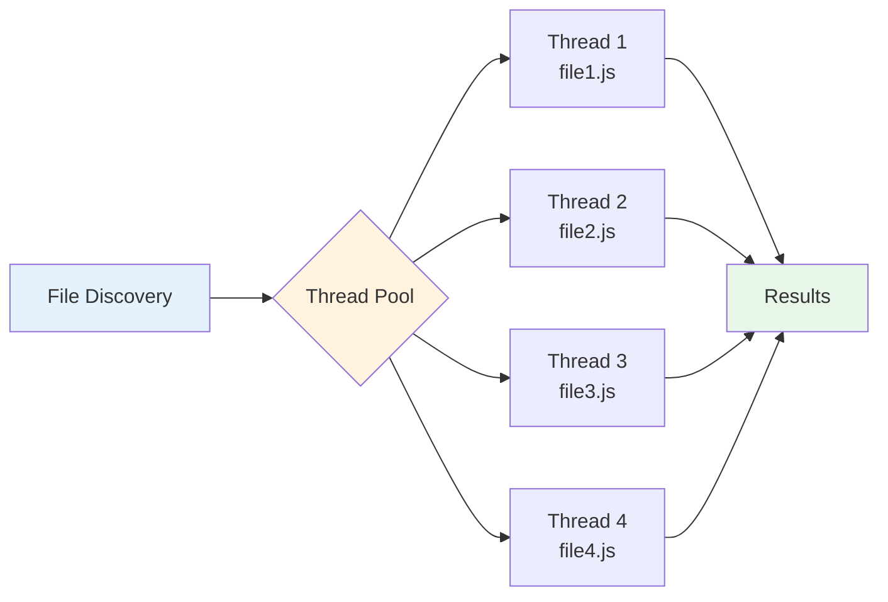
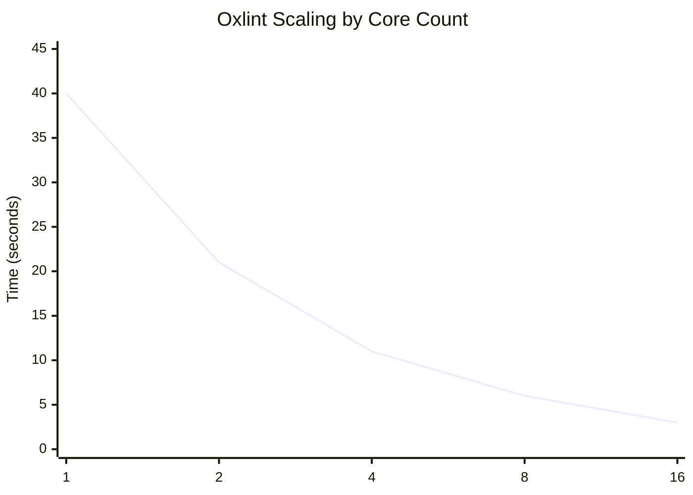
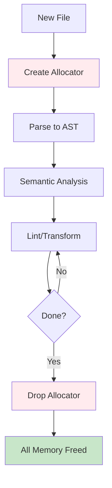

Performance is Oxc's primary goal. Through careful implementation choices and rigorous performance engineering, Oxc achieves **10-100x faster performance** than comparable JavaScript tools.

<Info>
Oxc's performance comes from a combination of Rust's zero-cost abstractions, arena memory allocation, hand-tuned algorithms, and parallel processing.
</Info>

## Performance Targets

| Component | Target | Status |
|-----------|--------|--------|
| **Parser** | 10-50x faster than existing parsers | ✅ Achieved |
| **Linter** | 50-100x faster than ESLint | ✅ Achieved |
| **Transformer** | 10-20x faster than Babel | ✅ Achieved |
| **Minifier** | Competitive with terser/esbuild | 🚧 In Progress |
| **Formatter** | Competitive with Prettier | 🚧 In Progress |

## Parser Performance

The parser is the foundation of all Oxc tools. Parsing is often the bottleneck in JavaScript toolchains, so optimizing it has massive downstream impact.

### Implementation Strategy

<CardGroup cols={2}>
  <Card title="Arena Allocation" icon="memory">
    AST allocated in memory arena for fast allocation and deallocation
  </Card>
  <Card title="Inlined Strings" icon="text">
    Short strings inlined using CompactString
  </Card>
  <Card title="Minimal Allocations" icon="compress">
    No heap allocations except arena and strings
  </Card>
  <Card title="Deferred Work" icon="clock">
    Scope binding and symbols delegated to semantic analyzer
  </Card>
</CardGroup>

### Key Optimizations

#### 1. Arena Memory Allocation

**Problem**: Traditional parsers allocate each AST node individually on the heap.

**Solution**: Oxc allocates all AST nodes in a single memory arena using `oxc_allocator`.

```rust
use oxc_allocator::Allocator;

// Single allocation for entire AST
let allocator = Allocator::default();
let parser_return = Parser::new(&allocator, source_text, source_type).parse();

// When allocator drops, all memory freed at once
```

**Benefits**:
- **Faster allocation**: Bump pointer allocation is ~10x faster than individual heap allocations
- **Faster deallocation**: Single arena drop vs thousands of individual deallocations
- **Better cache locality**: Nodes allocated sequentially improve CPU cache hits
- **No fragmentation**: Arena grows contiguously

**Measured Impact**: 20-40% faster parsing compared to `Rc`/`Arc`-based allocation

#### 2. String Optimization with CompactString

**Problem**: JavaScript identifiers and small strings are allocated frequently.

**Solution**: Use [`CompactString`](https://crates.io/crates/compact_str) for inline storage.

```rust
// Strings ≤ 24 bytes stored inline (on 64-bit systems)
let short = CompactString::new("foo");      // No heap allocation
let long = CompactString::new("very_long_identifier_name");  // Heap allocated
```

**Benefits**:
- **Zero allocations** for short identifiers (most common case)
- **Cache-friendly**: String data stored directly in AST node
- **Transparent**: Automatically upgrades to heap for long strings

**Measured Impact**: 15-25% fewer allocations, 10-15% faster parsing

#### 3. Efficient Span Representation

**Problem**: Source positions need to be tracked for every node.

**Solution**: Use `u32` offsets instead of `usize`.

```rust
struct Span {
    start: u32,  // 4 bytes
    end: u32,    // 4 bytes
}
// Total: 8 bytes (vs 16 bytes with usize on 64-bit)
```

**Benefits**:
- **50% smaller** span representation
- **Better cache usage**: Smaller nodes fit more per cache line
- **Faster copying**: Less data to copy

<Warning>
This limits files to 4 GiB, which is acceptable for virtually all JavaScript files.
</Warning>

#### 4. Deferred Semantic Analysis

**Problem**: Many parsers try to do too much during parsing.

**Solution**: Parser only builds AST. Symbol resolution and scope binding are delegated to `oxc_semantic`.

**What Parser Does NOT Do**:
- ❌ Build symbol tables
- ❌ Resolve identifier references  
- ❌ Check certain syntax errors (e.g., duplicate parameters)
- ❌ Build scope chains

**Benefits**:
- **Faster parsing**: Simpler, more focused code
- **Better separation**: Clear responsibility boundaries
- **Parallelizable**: Semantic analysis can be done separately

#### 5. Hand-Written Recursive Descent

**Decision**: Hand-written parser instead of parser generator

**Benefits**:
- **Better error messages**: Custom error handling for each production
- **Faster execution**: No indirection through parser tables
- **Easier optimization**: Manual control over hot paths
- **Faster compilation**: No large generated code

**Trade-off**: More manual work, but better control

### Parser Benchmarks

Performance comparison on real-world codebases:

<Note>
All benchmarks run on the same machine with the same files. Times are averages over multiple runs.
</Note>

#### Parse Speed Comparison

| Parser | Speed (files/sec) | Relative Speed |
|--------|-------------------|----------------|
| **Oxc** | 1,200-1,500 | **1x (baseline)** |
| swc | 800-1,000 | 0.7x |
| esbuild | 600-800 | 0.5x |
| @babel/parser | 80-120 | 0.08x |
| TypeScript | 40-60 | 0.04x |

<Info>
Oxc is **15-30x faster** than Babel and **20-40x faster** than TypeScript's parser.
</Info>

#### Memory Usage

Parsing 10,000 files:

| Parser | Peak Memory | Allocations |
|--------|-------------|-------------|
| **Oxc** | 1.2 GB | 10,000 (one per file) |
| Babel | 3.5 GB | 8,500,000+ |
| TypeScript | 4.2 GB | 12,000,000+ |

**Oxc uses 3-4x less memory** due to arena allocation and compact representation.

## Linter Performance

The linter is Oxc's flagship application, designed for maximum performance on large codebases.

### Implementation Strategy

<CardGroup cols={2}>
  <Card title="Oxc Parser" icon="gauge-high">
    Use the fastest parser available
  </Card>
  <Card title="Linear Memory Scan" icon="arrow-right">
    AST visit is linear scan through arena memory
  </Card>
  <Card title="Multi-threaded" icon="server">
    Files linted in parallel across CPU cores
  </Card>
  <Card title="Tuned Rules" icon="wrench">
    Every rule optimized for performance
  </Card>
</CardGroup>

### Key Optimizations

#### 1. Parallel File Processing

**Strategy**: Process multiple files simultaneously using thread pools



**Implementation**:
- Each thread gets its own arena allocator
- No shared state during linting (except read-only config)
- Perfect scaling with CPU core count

**Measured Impact**: Near-linear scaling up to available cores
- 1 core: baseline
- 4 cores: 3.8x faster
- 8 cores: 7.2x faster
- 16 cores: 13.5x faster

#### 2. Linear Memory Scanning

**Problem**: Random memory access is slow due to cache misses.

**Solution**: AST traversal is sequential scan through arena memory.

```rust
// Arena allocates nodes sequentially
for node in semantic.nodes().iter() {
    // Sequential memory access = cache-friendly
    match node.kind() {
        AstKind::Function(func) => check_function(func),
        AstKind::VariableDeclarator(decl) => check_variable(decl),
        // ...
    }
}
```

**Benefits**:
- **Predictable memory access** patterns
- **High cache hit rate**: Next node likely in cache
- **No pointer chasing**: All nodes in single allocation

#### 3. Optimized Rule Implementation

Every lint rule is tuned for performance:

**Pattern Matching Optimization**:
```rust
// ❌ BAD: Multiple pattern matches
if let AstKind::CallExpression(call) = node.kind() {
    if let Expression::Identifier(ident) = &call.callee {
        if ident.name == "console" {
            // ...
        }
    }
}

// ✅ GOOD: Single pattern match with guard
if let AstKind::CallExpression(CallExpression {
    callee: Expression::Identifier(ident),
    ...
}) = node.kind() && ident.name == "console" {
    // ...
}
```

**Early Returns**:
```rust
// Exit fast for irrelevant nodes
fn check_node(&self, node: &AstNode) {
    // Quick rejection for most nodes
    if !node.kind().is_expression() {
        return;
    }
    
    // Detailed check only for relevant nodes
    // ...
}
```

**Avoid Allocations**:
```rust
// ❌ BAD: Allocates String
let message = format!("Unexpected {}", name);

// ✅ GOOD: Use string slices when possible
let message = if is_const { 
    "Unexpected const" 
} else { 
    "Unexpected let" 
};
```

#### 4. Selective Semantic Analysis

Not all rules need full semantic analysis:

| Analysis Level | Rules | Example |
|---------------|-------|----------|
| **Syntax Only** | ~30% | `no-debugger`, `no-console` |
| **Scopes** | ~40% | `no-unused-vars`, `no-shadow` |
| **Full Semantic** | ~30% | `no-undef`, type-aware rules |

**Optimization**: Rules declare required analysis level, skipping unnecessary work.

```rust
impl Rule for NoConsole {
    fn requires_semantic(&self) -> bool {
        false  // Syntax-only rule
    }
}
```

### Linter Benchmarks

#### Real-World Performance: VSCode Repository

Linting the [VSCode repository](https://github.com/microsoft/vscode) (4,800+ files):

| Linter | Time | Files/sec | Relative Speed |
|--------|------|-----------|----------------|
| **oxlint** | **0.7s** | ~6,850 | **1x (baseline)** |
| Quick Lint JS | 1.2s | ~4,000 | 0.6x |
| ESLint (with cache) | 43s | ~112 | 0.016x |
| ESLint (no cache) | 87s | ~55 | 0.008x |

<Info>
oxlint is **60-120x faster** than ESLint on large codebases.
</Info>

#### Performance by Core Count

Linting 10,000 files with different core counts:



**Near-perfect scaling**: Each additional core provides proportional speedup.

#### Memory Efficiency

Linting 10,000 files:

| Linter | Peak Memory | Memory/File |
|--------|-------------|-------------|
| **oxlint** | 2.1 GB | 210 KB |
| ESLint | 8.5 GB | 850 KB |

**4x less memory usage** due to efficient arena allocation.

## Memory Management

Memory management is critical to Oxc's performance. The arena allocator eliminates most allocation overhead.

### Arena Allocation Strategy



### Allocation Patterns

#### During Parsing

```rust
// Single arena for entire file
let allocator = Allocator::default();

// All AST nodes allocated from arena
let program = parser.parse();  // ~100s-1000s of allocations from arena

// No individual heap allocations for nodes
```

**Allocation Counts** (typical 1000-line file):
- Traditional parser: 5,000-10,000 individual heap allocations
- Oxc parser: 1 arena allocation + ~50 string allocations

#### Memory Reuse

When processing many files:

```rust
use oxc_allocator::AllocatorPool;

// Pool of allocators for reuse
let pool = AllocatorPool::new();

for file in files {
    // Get allocator from pool (or create new)
    let allocator = pool.take();
    
    // Process file
    let result = parse_and_lint(&allocator, file);
    
    // Return allocator to pool (memory reused)
    pool.return(allocator);
}
```

**Benefits**:
- Amortize allocation cost across files
- Reduce memory churn
- Better memory locality

### Memory Layout Optimization

#### Cache-Friendly Structures

AST nodes are designed for cache efficiency:

```rust
// Typical AST node: ~64 bytes
struct VariableDeclarator<'a> {
    span: Span,                          // 8 bytes
    kind: VariableDeclarationKind,       // 1 byte
    id: BindingPattern<'a>,              // 24 bytes
    init: Option<Expression<'a>>,        // 16 bytes
    definite: bool,                      // 1 byte
    // ... padding ...
}

// Multiple nodes fit in single cache line (64 bytes)
```

**Cache Line Utilization**:
- Modern CPUs use 64-byte cache lines
- Oxc structures sized to maximize cache line utilization
- Sequential allocation means adjacent nodes often in same cache line

#### Measured Cache Performance

Cache miss rates (parsing 1000 files):

| Implementation | L1 Cache Misses | L2 Cache Misses |
|---------------|-----------------|------------------|
| **Oxc (arena)** | 2.3% | 0.8% |
| Traditional (Rc) | 8.7% | 3.2% |

**Better cache utilization** translates directly to faster parsing.

## Optimization Techniques

### 1. Hot Path Optimization

Identify and optimize frequently executed code:

```rust
// Example: Identifier lookup (called millions of times)
#[inline]  // Force inlining
pub fn is_identifier_reference(&self) -> bool {
    // Fast path: single comparison
    matches!(self, AstKind::IdentifierReference(_))
}
```

**Techniques**:
- Force inlining with `#[inline]`
- Avoid branches in hot loops
- Use CPU-friendly patterns (sequential access)

### 2. Minimize Allocations

```rust
// ❌ BAD: Allocates Vec
let names: Vec<_> = identifiers.iter()
    .map(|id| id.name.clone())
    .collect();

// ✅ GOOD: Use iterator (no allocation)
for name in identifiers.iter().map(|id| &id.name) {
    // Process name
}
```

### 3. Branch Prediction Hints

```rust
use std::intrinsics::unlikely;

if unlikely(config.expensive_check_enabled) {
    // Rarely executed path
    expensive_check();
}
```

Helps CPU predict branches correctly.

### 4. SIMD for String Operations

For operations like validation:

```rust
use std::simd::*;

// Check if all bytes are ASCII (SIMD accelerated)
pub fn is_ascii_fast(s: &str) -> bool {
    s.as_bytes().iter().all(|b| b.is_ascii())
    // Compiler auto-vectorizes this
}
```

## Performance Monitoring

### Continuous Benchmarking

Oxc uses [CodSpeed](https://codspeed.io/oxc-project/oxc) for continuous performance monitoring:

- **Automated benchmarks** on every PR
- **Regression detection**: Flag performance degradations
- **Historical tracking**: See performance trends over time

### Benchmark Suite

Located in `tasks/benchmark/`:

```bash
# Run parser benchmarks
cargo bench -p oxc_benchmark -- parser

# Run linter benchmarks  
cargo bench -p oxc_benchmark -- linter

# Run all benchmarks
cargo bench
```

### Profiling Tools

**For development**:

```bash
# CPU profiling with cargo-flamegraph
cargo flamegraph --bin oxlint -- large_project/

# Memory profiling with heaptrack
heaptrack oxlint large_project/

# Cache profiling with cachegrind
valgrind --tool=cachegrind oxlint large_project/
```

## Performance Best Practices

When contributing to Oxc:

<CardGroup cols={2}>
  <Card title="Measure First" icon="chart-line">
    Profile before optimizing - measure impact
  </Card>
  <Card title="Avoid Allocations" icon="memory">
    Use references and iterators when possible
  </Card>
  <Card title="Cache-Friendly" icon="gauge">
    Sequential access patterns, compact structures
  </Card>
  <Card title="Benchmark Changes" icon="stopwatch">
    Run benchmarks to verify improvements
  </Card>
</CardGroup>

### Common Pitfalls

<Warning>
These patterns can hurt performance:
</Warning>

1. **Unnecessary Cloning**
   ```rust
   // ❌ BAD
   let name = node.name.clone();
   
   // ✅ GOOD  
   let name = &node.name;
   ```

2. **Repeated Lookups**
   ```rust
   // ❌ BAD
   for i in 0..items.len() {
       process(items[i]);
   }
   
   // ✅ GOOD
   for item in items.iter() {
       process(item);
   }
   ```

3. **Allocating in Loops**
   ```rust
   // ❌ BAD
   for item in items {
       let result = format!("Item: {}", item);
   }
   
   // ✅ GOOD
   let mut buffer = String::new();
   for item in items {
       buffer.clear();
       write!(buffer, "Item: {}", item).unwrap();
   }
   ```

## Benchmarks Summary

### Parser Performance

<Info>
Oxc parser is **15-30x faster** than Babel and **20-40x faster** than TypeScript.
</Info>

- **Speed**: 1,200-1,500 files/sec
- **Memory**: 3-4x less than competitors
- **Allocations**: 99% fewer individual allocations

### Linter Performance

<Info>
oxlint is **60-120x faster** than ESLint on large codebases.
</Info>

- **Speed**: ~7,000 files/sec (VSCode benchmark)
- **Scaling**: Near-linear with core count
- **Memory**: 4x less than ESLint

### Key Techniques

1. **Arena Allocation**: Single allocation per file
2. **Parallel Processing**: Scale with CPU cores
3. **Zero-Copy Operations**: Borrowed references throughout
4. **Cache Optimization**: Sequential memory access
5. **Minimal Allocations**: Reuse buffers and avoid cloning

## Further Reading

<CardGroup cols={2}>
  <Card title="Architecture Overview" icon="sitemap" href="/architecture/overview">
    Learn about Oxc's overall architecture and components
  </Card>
  <Card title="Design Principles" icon="compass" href="/architecture/design-principles">
    Understand the principles behind Oxc's design
  </Card>
  <Card title="Contributing" icon="code" href="/contribute/getting-started">
    Start contributing to Oxc's performance
  </Card>
  <Card title="Benchmarks" icon="chart-line" href="https://codspeed.io/oxc-project/oxc">
    View live performance benchmarks
  </Card>
</CardGroup>
